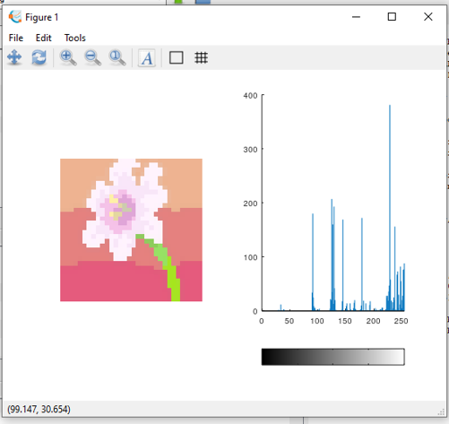
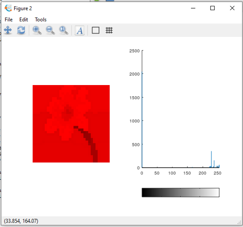
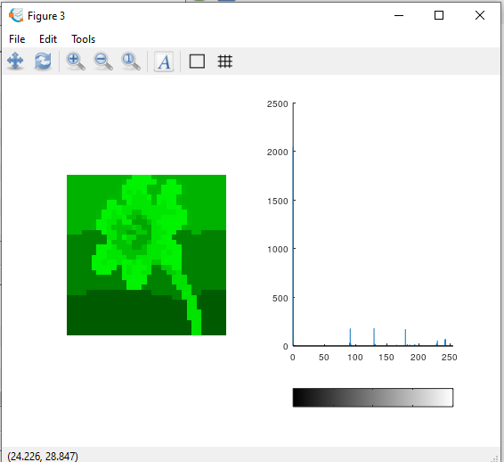
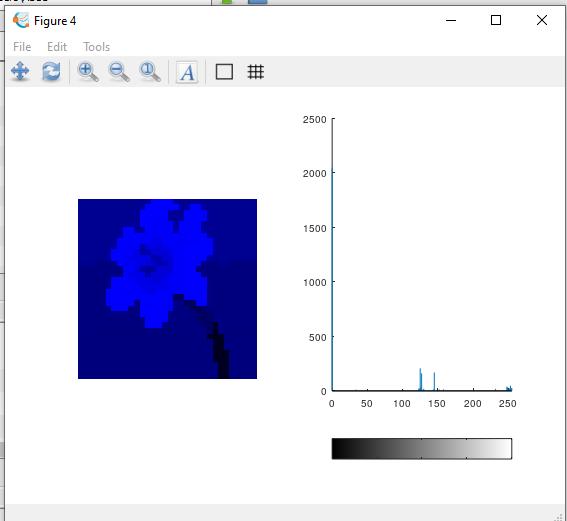
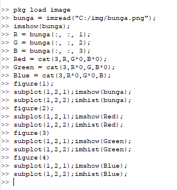
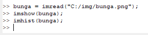
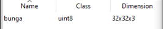
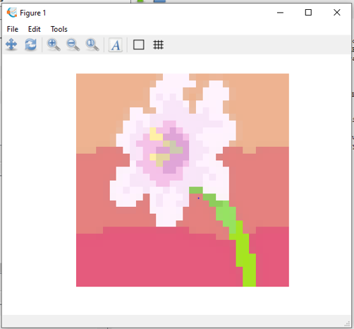
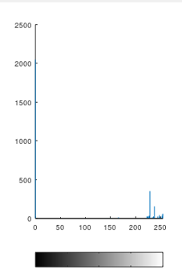

Nama: Iif Alifah

NIM: 2110131220013

---

<h2 align="center"><b> Tugas 2 Pemrosesan Citra Digital</b></h2>
 

* Gambar dengan ukuran 32x32 yang saya gunakan adalah:

1. Layer pada gambar

Dalam sebuah gambar terdapat 3 layer didalamnya yaitu layer red, green dan blue. Pada gambar dibawah ini di tampilkan gambar beserta histogramnya.

Perintah yang digunakan untuk merepresentasikan RGB nya yaitu:

* Menggunakan figure() untuk menambahkan gambar berbeda figure  
* Menggunakan subplot untuk mengatur posisi gambarnya.

2. Menggunakan fungsi (1) imread, (2) imshow (3) dan imhist.

* Fungsi imread digunakan untuk membaca file image tersebut, sehingga akan menampilkan beberapa informasi.

* Fungsi imshow digunakan untuk menampilkan gambar.

* Fungsi imhist digunakan untuk menampilkan gambar dalam bentuk histogram

