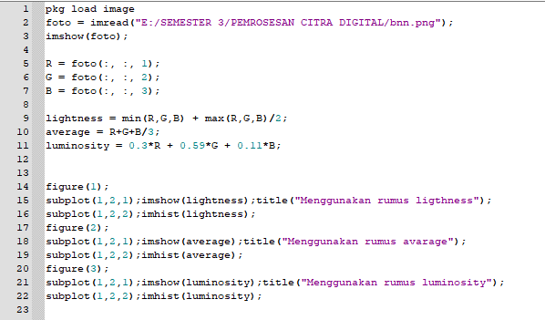
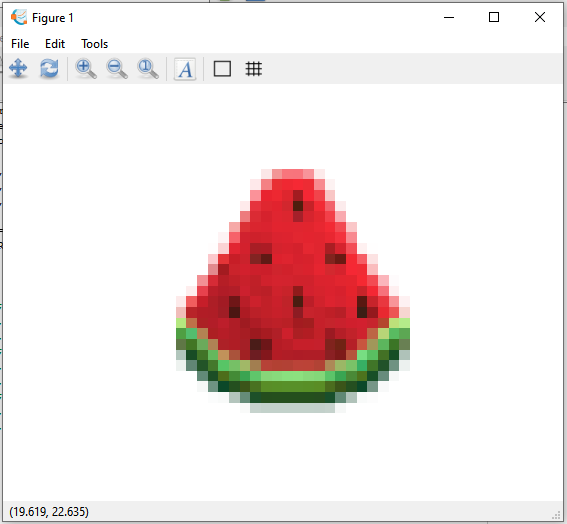
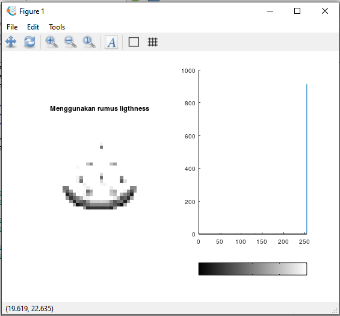
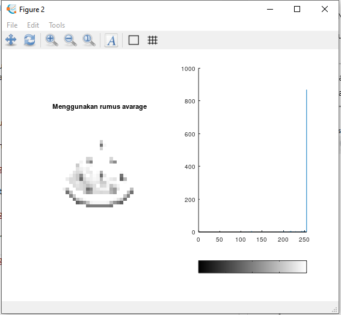
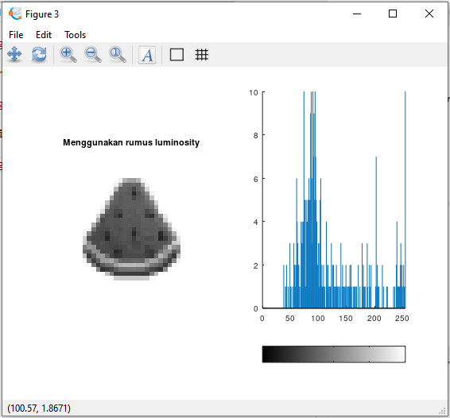
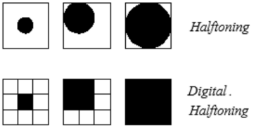

Nama: Iif Alifah
NIM: 2110131220013

Tugas 3 Menggunakan 3 Rumus Greyscale dan Ulasan mengenai Halftoning, Dithering dan Patterning

---

### **Menggunakan 3 Rumus Greyscale

* Code

* Foto tanpa menggunakan method greyscale

* Foto dengan ligthness method

Mencari nilai terendah dan tertinggi dari RGB, kemudian nilai tersebut dijumlahkan lalu dibagi 2.

* Foto dengan avarage method

Menjumlahkan semua nilai RGB, kemudian dibagi 3 sehingga akan diperoleh rata-rata dari RGB.

* Foto dengan luminosity method

Mengalikan setiap nilai RGB dengan nilai yang sudah ditetapkan. lalu hasil kalinya dijumlahkan.

Dari ketiga method diatas masing-masing menghasilkan warna greyscale, namun tingkat greyscalenya berbeda-beda. gambar greyscale yang paling pas tingkatan warnanya adalah method luminosity.

---

### Ulasan mengenai Halftoning, Dithering, dan Patterning

* **Halftoning**

Halftone dapat diartikan sebagai setengah warna. Dalam konteks
pengolahan citra, Halftone dapat diartikan sebagai sebuah citra yang pada detailnya disisipi oleh titik-titik yang dikenal dengan noise. Penyisipan titik-titik melalui proses distribusi titik-titik noise tersebut secara homogen dan berkelanjutan hingga membentuk gambar yang dapat dikenali oleh manusia.

Pemanfaatan halftone yang diimplementasikan pada citra sering kali ditemui pada perangkat atau mesin pencetak. Dimana, pada mesin pencetak yang memanfaatkan sinar laser, halftone digunakan untuk mengkontrol sinar dalam membentuk sebuah citra pada media yang digunakan dalam mencetak. Dan pada mesin pencetak dengan teknologi inkjet, halftone diimplementasikan dalam menentukan posisi tinta dengan spasial atau jarak-jarak tertentu dalam menjatuhkan tinta saat mencetak pada media yang digunakan. 

Dua implementasi halftone dikenal dalam pengolahan citra seperti pada
gambar diatas yaitu Halftoning Analog dan Digital Halftoning. Dimana pada
Halftoning Analog, detail yang diberikan lebih menyerupai titik lingkaran
sedangkan pada Halftoning Digital detail yang diberikan menyerupai persegi pada
piksel citra.

Implementasi Halftoning Analog sering dijumpai pada mesin cetak dengan format percetakan kuantitas besar, misalnya pada percetakan surat kabar. Sedangkan, Halftoning Digital sering dijumpai pada jenis percetakan rumahan dan sering dimanfaatkan dalam fotolitografi, yaitu proses semi konduktor yang digunakan dalam pemindahan pola ke sebuah substrat dengan memanfaatkan cetakan berdasarkan potongan pada bahan semi konduktor sebagai media pencetaknya.

---

* **Dithering**

