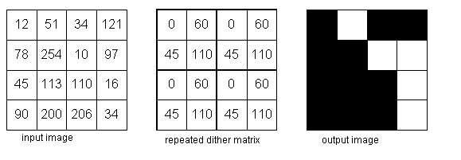
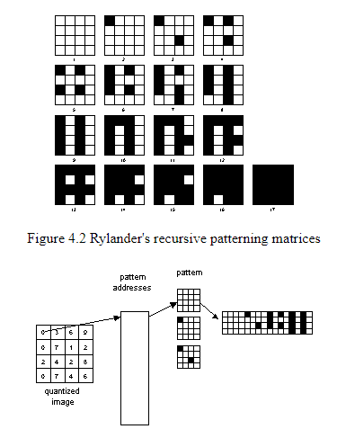

Nama: Iif Alifah
NIM: 2110131220013

Tugas 3 Menggunakan 3 Rumus Greyscale dan Ulasan mengenai Halftoning, Dithering dan Patterning

---

### **Menggunakan 3 Rumus Greyscale

* Code

* Foto tanpa menggunakan method greyscale

* Foto dengan ligthness method

Mencari nilai terendah dan tertinggi dari RGB, kemudian nilai tersebut dijumlahkan lalu dibagi 2.

* Foto dengan avarage method

Menjumlahkan semua nilai RGB, kemudian dibagi 3 sehingga akan diperoleh rata-rata dari RGB.

* Foto dengan luminosity method

Mengalikan setiap nilai RGB dengan nilai yang sudah ditetapkan. lalu hasil kalinya dijumlahkan.

Dari ketiga method diatas masing-masing menghasilkan warna greyscale, namun tingkat greyscalenya berbeda-beda. gambar greyscale yang paling pas tingkatan warnanya adalah method luminosity.

---

### Ulasan mengenai Halftoning, Dithering, dan Patterning

* **Halftoning**

Halftone dapat diartikan sebagai setengah warna. Dalam konteks
pengolahan citra, Halftone dapat diartikan sebagai sebuah citra yang pada detailnya disisipi oleh titik-titik yang dikenal dengan noise. Penyisipan titik-titik melalui proses distribusi titik-titik noise tersebut secara homogen dan berkelanjutan hingga membentuk gambar yang dapat dikenali oleh manusia.

Pemanfaatan halftone yang diimplementasikan pada citra sering kali ditemui pada perangkat atau mesin pencetak. Dimana, pada mesin pencetak yang memanfaatkan sinar laser, halftone digunakan untuk mengkontrol sinar dalam membentuk sebuah citra pada media yang digunakan dalam mencetak. Dan pada mesin pencetak dengan teknologi inkjet, halftone diimplementasikan dalam menentukan posisi tinta dengan spasial atau jarak-jarak tertentu dalam menjatuhkan tinta saat mencetak pada media yang digunakan. 

Dua implementasi halftone dikenal dalam pengolahan citra seperti pada
gambar diatas yaitu Halftoning Analog dan Digital Halftoning. Dimana pada
Halftoning Analog, detail yang diberikan lebih menyerupai titik lingkaran
sedangkan pada Halftoning Digital detail yang diberikan menyerupai persegi pada
piksel citra.

Implementasi Halftoning Analog sering dijumpai pada mesin cetak dengan format percetakan kuantitas besar, misalnya pada percetakan surat kabar. Sedangkan, Halftoning Digital sering dijumpai pada jenis percetakan rumahan dan sering dimanfaatkan dalam fotolitografi, yaitu proses semi konduktor yang digunakan dalam pemindahan pola ke sebuah substrat dengan memanfaatkan cetakan berdasarkan potongan pada bahan semi konduktor sebagai media pencetaknya.

---

* **Dithering**

Teknik lain yang digunakan untuk menghasilkan gambar halftoning digital adalah dithering. Tidak seperti pola, dithering membuat gambar keluaran dengan jumlah titik yang sama dengan jumlah piksel pada gambar sumber. Dithering dapat dianggap sebagai thresholding gambar sumber dengan matriks gentar. Matriks diletakkan berulang kali di atas gambar sumber. Dimanapun nilai piksel gambar lebih besar dari nilai dalam matriks, titik pada gambar output diisi. Masalah dithering yang terkenal adalah menghasilkan artefak pola yang diperkenalkan oleh matriks ambang batas tetap. Gambar dibawah
ini menunjukkan contoh operasi dithering.

---

* **Patterning**

Patterning adalah yang paling sederhana dari beberapa teknik untuk menghasilkan gambar halftoning digital. Teknik ini menghasilkan gambar yang memiliki resolusi spasial lebih tinggi daripada gambar sumber. Jumlah sel halftone citra keluaran sama dengan jumlah piksel citra sumber. Namun, setiap sel halftone dibagi lagi menjadi kotak 4x4. Setiap nilai piksel input diwakili oleh jumlah kotak terisi yang berbeda dalam sel halftone. Karena kisi 4x4 hanya dapat mewakili 17 tingkat intensitas yang berbeda, gambar sumber harus dikuantisasi. Gambar dibawah ini menunjukkan matriks pola rekursif Rylander.

pattern menghasilkan gambar halftoning digital dari gambar input menggunakan teknik pola. Pola program membaca gambar input, mengkuantisasi nilai piksel, dan memetakan setiap piksel ke pola yang sesuai.

---

1. **Cara menentukan pola pada patterning dan dithering**

* Pada Patterning

Untuk menentukan pola pada patterning dapat dilakukan dengan melakukan perhitungan jumlah font biner lalu ditambah 1. Dan untuk pola yang di hasilkan nanti akan berbeda antara satu dengan yang lainnya. 

* Pada Dithering

Karena sistem visual manusia cenderung meratakan suatu area di sekitar piksel,
bukan melihat setiap piksel secara sendiri-sendiri, sehingga memungkinkan untuk
membuat ilusi dari beberapa tingkat keabuan di dalam sebuah citra biner yang dalam
kenyataanya hanya terdiri dari dua tingkat abu-abu. 

Untuk menghasilkan pola pada dithering dilakukan dengan membandingkan tiap blok dari citra asli
dengan sebuah matriks pembatas yang disebut dengan matriks dither. Masing-masing elemen dari blok asli dikuantisasi sesuai dengan nilai batas pada pola dither. Jika nilai nya lebih besar dari batas maka menjadi hitam, dan jika nilai nya lebih kecil dari batas maka warnanya menjadi putih.

2. **Cara menentukan matriks threshold pada dithering**

Thresholding merupakan salah satu metode segmentasi citra dalam suatu citra berdasarkan pada perbedaan tingkat kecerahan atau gelap terang . Dalam proses ini dibutuhkan suatu nilai batas yang disebut nilai threshold. Keluaran dari proses segmentasi dengan metode thresholding adalah berupa citra biner dengan nilai intensitas piksel sebesar 0 atau 1. Warna hitam yang dinyatakan oleh nilai 0 dan warna putih yang dinyatakan oleh nilai 1.
Jika nilai intensitasnya lebih dari nilai threshold maka akan di rubah menjadi hitam, dan jika nilai intensitasnya kurang dari nilai threshold maka akan dirubah menjadi warna putih.

3. **Mengapa pola dittering yang kecil (4x4) tidak sebagus yang lebih besar (16x16)**

Karena dari gambar atau keluaran yang akan dihasilkan dari pola-pola matriks tersebut akan terlihat perbedaan antara matriks 4x4 dengan matriks 16x16. Perbedaan yang dihasilkan terletak pada sensitifitas nilai pixel aslinya. Citra yang menggunakan matriks 4 x 4 memiliki pola yang kurang dibandingkan dengan citra yang diproses menggunakan matriks 16 x 16. Karena itu hasil dari citra dengan 4 x 4 memiliki banyak daerah pola yang sama.

